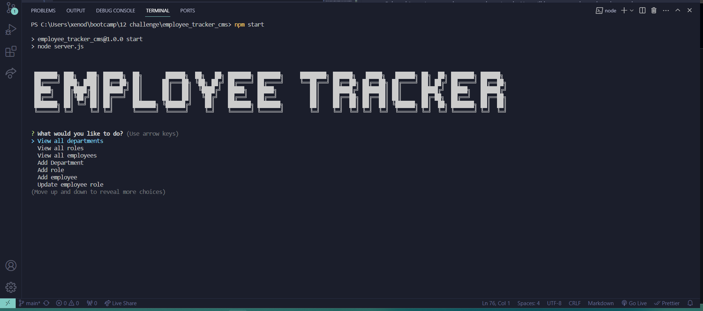
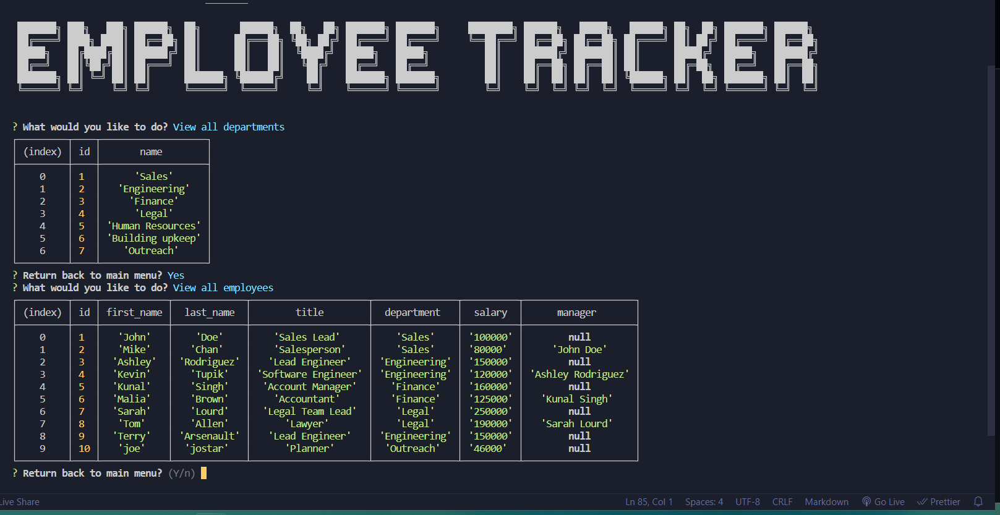
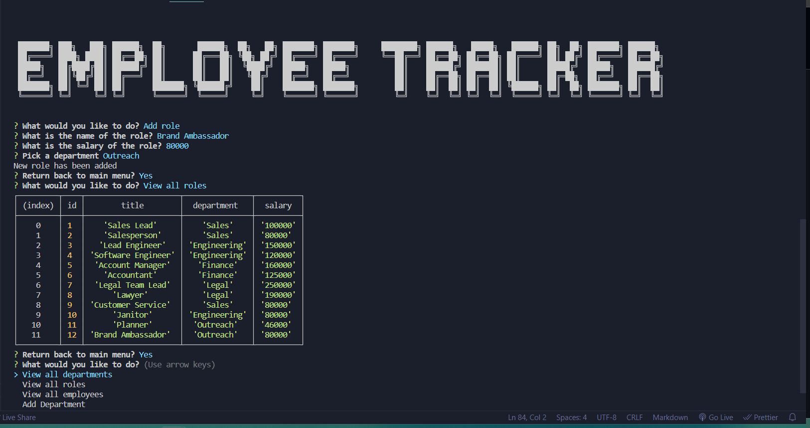

# Employee Tracker CLI Application

## Description

A command-line application that allows business owners to efficiently view and manage departments, roles, and employees within their company.

## Table of Contents

- [Features](#features)
- [Installation](#installation)
- [Usage](#usage)
- [Commands](#commands)
  - [View All Departments](#view-all-departments)
  - [View All Roles](#view-all-roles)
  - [View All Employees](#view-all-employees)
  - [Add a Department](#add-a-department)
  - [Add a Role](#add-a-role)
  - [Add an Employee](#add-an-employee)
  - [Update an Employee Role](#update-an-employee-role)
- [Screen Shot](#screen-shot)
- [Video Link](#video-link)
- [License](#license)

## Features

- View all departments, roles, and employees.
- Add new departments, roles, and employees.
- Update an employee's role.

## Installation

1. Clone the repository.
```bash
    git clone https://github.com/XenodiusAlpha/employee_tracker_cms.git
```
2. Navigate to the project directory.
3. Run `npm install` to install dependencies.
```bash
    npm install
```
4. Navigate to the `db` folder, run the database, and seed the database.
```bash
    cd db
    mysql -u root -p
    Enter Password: ***Your password here***
    SOURCE schema.sql;
    SOURCE seed.sql;
    exit
```
5. Navigate to root directory, and create pass.js file.
6. Set up your password for the connection.
```
const pass = "YOUR PASSWORD HERE";

module.exports = pass;
```

## Usage

1. Run the application by executing `node index.js` in the terminal.
```bash
    node index.js
```
2. Follow the on-screen prompts to navigate through different options.
3. Use the provided commands to view, and add departments, roles, and employees, as well as update employee roles.

## Commands

### View All Departments

Select this option to view a formatted table displaying department names and department IDs.

### View All Roles

Select this option to view a formatted table showing job titles, role IDs, the corresponding department, and salary for each role.

### View All Employees

Select this option to view a formatted table displaying employee data, including IDs, first names, last names, job titles, departments, salaries, and their reporting managers.

### Add a Department

Choose this option to add a new department. You will be prompted to enter the name of the department, and it will be added to the database.

### Add a Role

Choose this option to add a new role. You will be prompted to enter the name, salary, and department for the role, and it will be added to the database.

### Add an Employee

Choose this option to add a new employee. You will be prompted to enter the employee’s first name, last name, role, and the employee will be added to the database.

### Update an Employee Role

Select this option to update an employee's role. You will be prompted to select the employee to update and their new role. The information will be updated in the database.

## Screen Shot




## Video Link
https://drive.google.com/file/d/1R5nPgsLOPYWXcuWaSSCfqaBR1EAyVK-9/view?usp=sharing

## License

This project is licensed under the [MIT License](LICENSE).